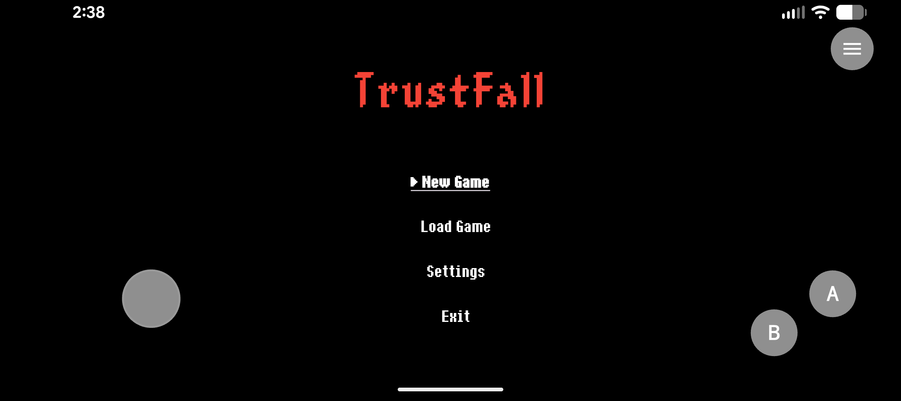
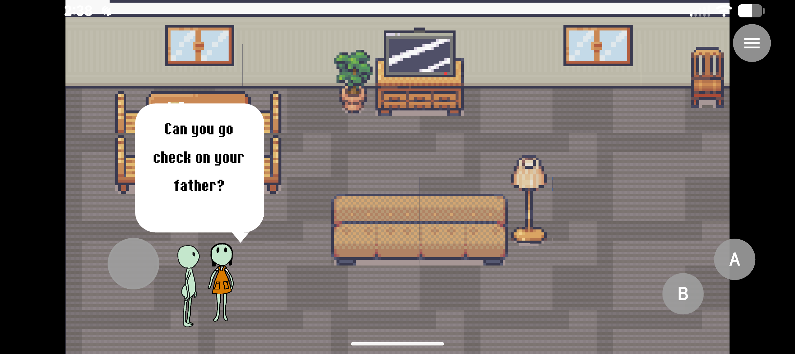
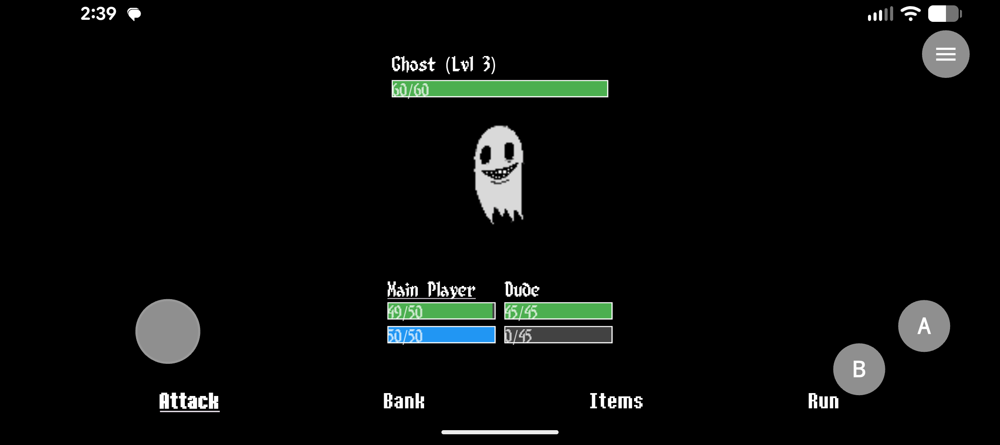
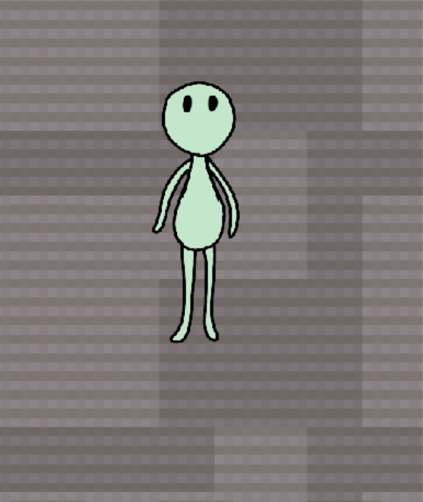

# TrustFall 

**TrustFall** is a narrative-driven indie RPG built with **Flutter** and the **Flame engine**. It focuses on emotional storytelling, turn-based battles, and multi-input gameplay.

---

## General Description

TrustFall combines quirky characters and emotional themes with a modular Flutter codebase. Think *Undertale meets open-source*. It features:

- Touch, keyboard, and controller input support
- Party-based turn-based battles
- Dialogue trees with choices
- Smooth room transitions 
- NPC interactions
- Persistent state via SharedPreferences

Built with PC and mobile in mind.

---

## 🎮 Input Handling

Input is unified using `KeyboardGamepadListener` and `TouchControl` widgets that listen to:

- Gamepad inputs
- Keyboard events (arrow keys, Z/X)
- Touch controls (joystick/d-pad)

All map navigation, menus, and battle actions route through this system.

---

## 🧪 Battle System

Characters (player and enemies) use `BattleCharacter` objects containing:

- Stats (HP, XP, Level, Speed, etc.)
- Inventory & attacks
- Status effects

The `BattleManager` handles:

- Turn queue based on speed
- Target selection and damage logic
- Message queuing and delays
- Battle statuses (sleep, confused, etc)

---


## 🧱 Maps & Transitions

Rooms are created as separate Tiled tilemaps. Each has a corresponding `FlameComponent` like `MainPlayerHouse`, which uses an enum to swap between internal rooms.

Doors have a `destination` property that triggers room transitions.

---

## 🛠 How to Build & Run

1. Clone the repo:
   ```bash
   git clone https://github.com/billyrigdon/trustfall.git
   cd trustfall
   ```

2. Get dependencies:
   ```bash
   flutter pub get
   ```

3. Run it:
   ```bash
   flutter run
   ```

> Supports Android, iOS, Windows, macOS, and Linux

---

## 🖼 Screenshots









---

## ✨ Inspirations

- Earthbound
- Undertale
- List The Painful
- Pokemon

---

## 📄 License

MIT — use freely, credit welcome.

---

## 🧡 Support

Star the repo ⭐, fork it, or come hang out on TikTok [@billy.dev](https://tiktok.com/@billy.dev). I'd love to see what you build.

---